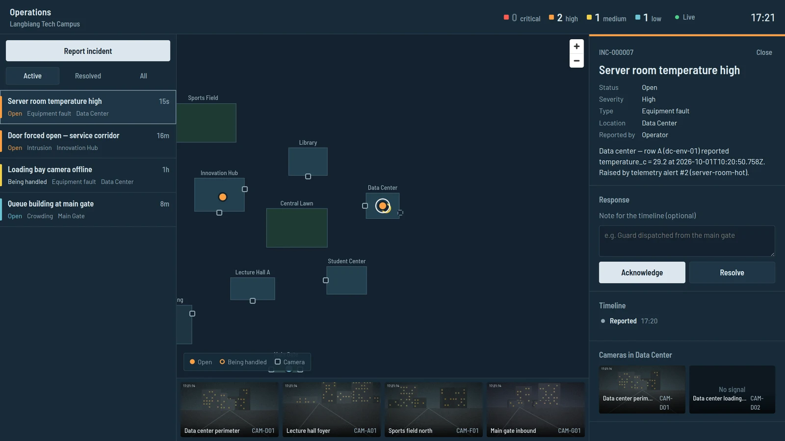
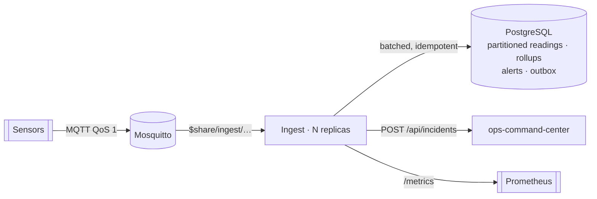

# IoT Telemetry Pipeline

[](https://github.com/truongtankhanh/iot-telemetry-pipeline/actions/workflows/ci.yml)


Sensor telemetry from a campus — server-room temperatures, CO₂ in lecture halls, power draw —
ingested over MQTT, stored in PostgreSQL, turned into alerts with hysteresis, and delivered as
incidents to [ops-command-center](https://github.com/truongtankhanh/ops-command-center).



_The incident above was raised by this pipeline: three readings over 27 °C opened an alert, the
outbox delivered it to ops-command-center, and when the temperature fell back below 25.5 °C the
incident was resolved automatically._

## Highlights

- **≈ 10 000 messages/s (≈ 20 000 readings/s) end to end on one replica** — broker to committed
  rows, rollups and rules included — with zero loss and zero duplicates. [Benchmarks](docs/benchmarks.md)
- **Horizontal scale-out** with MQTT 5 shared subscriptions; replicas are stateless and race-safe.
- **Idempotent storage**: redelivered messages hit the primary key; rollups are computed from the
  rows actually inserted, so duplicates never inflate counts.
- **Completeness is measured**: per-device sequence numbers expose every lost message as a
  metric. In the first benchmark that metric caught a broker silently dropping 10 % of a burst
  under default settings — accounting for every one of 5 127 missing messages.
- **Alerts that don't flap**: consecutive-breach counts and separate clear thresholds.
- **Reliable delivery** through a transactional outbox, `SKIP LOCKED` claiming and backoff.
- **No extensions required**: plain PostgreSQL with daily partitions, retention by `DROP TABLE`,
  and a documented TimescaleDB upgrade path.
- **Operable**: Prometheus metrics, liveness/readiness/startup probes, graceful drain on SIGTERM,
  Kubernetes manifests with HPA and PodDisruptionBudget.

## How it works



1. Devices publish `{ seq, ts, metrics }` to `campus/<zone>/<device>/telemetry`.
2. The service validates topic, device, zone and values; rejections are counted by reason.
3. Readings are buffered and flushed every 250 ms or 1 000 readings in one transaction:
   insert → roll up what was inserted → update `last_seen`.
4. Rules evaluate newly stored readings; opening or clearing an alert writes an outbox row in the
   same transaction.
5. The delivery worker creates the incident in ops-command-center, and resolves it when the
   alert clears.

Design and trade-offs: [architecture](docs/architecture.md) and five ADRs —
[shared subscriptions](docs/adr/0001-mqtt-shared-subscriptions.md) ·
[ack on receipt, bounded loss](docs/adr/0002-ack-on-receipt-with-bounded-loss.md) ·
[partitions and rollups](docs/adr/0003-plain-postgres-partitions-and-rollups.md) ·
[rules with hysteresis](docs/adr/0004-rules-with-hysteresis.md) ·
[alert outbox](docs/adr/0005-alert-outbox.md).

## Run it

```bash
docker compose --profile demo up --build
```

Brings up PostgreSQL, Mosquitto, the ingest service and a simulator running the
`server-room-overheat` scenario. Then:

```bash
curl localhost:3100/api/alerts                    # opens ~25 s after start, clears about a minute later
curl "localhost:3100/api/devices/dc-env-01/readings?metric=temperature_c"
curl localhost:3100/metrics | grep telemetry_     # throughput, rejections, gaps, lag
open http://localhost:3100/api/docs               # OpenAPI
```

**Together with ops-command-center:** start it (`docker compose up` in that repo), then run this
stack with `OCC_API_URL=http://host.docker.internal:3000/api docker compose --profile demo up`.
Alerts appear in its console as incidents and resolve themselves when values recover.

**Kubernetes (kind, k3d, minikube):**

```bash
docker build -f apps/ingest/Dockerfile -t telemetry-ingest:local .
kind load docker-image telemetry-ingest:local
kustomize build --load-restrictor LoadRestrictionsNone deploy/k8s/overlays/local | kubectl apply -f -
```

## Repository layout

```
apps/
  ingest/        NestJS service: MQTT consumer, batch writer, rules, outbox, API, metrics
    config/      devices.json (registry) and rules.json (thresholds) — reviewed as code
  simulator/     synthetic devices with scripted anomalies, and the benchmark
packages/
  telemetry-contract/   topic layout and payload parser shared by devices and service
deploy/
  mosquitto/     broker config (queue limits matter — see benchmarks)
  k8s/           kustomize base + local overlay
docs/            architecture, ADRs, benchmarks, roadmap
```

## Configuration

| Variable                                   | Default                 | Purpose                                                        |
| ------------------------------------------ | ----------------------- | -------------------------------------------------------------- |
| `DATABASE_URL`                             | —                       | PostgreSQL 14+                                                 |
| `MQTT_URL`                                 | `mqtt://localhost:1883` | Broker                                                         |
| `MQTT_SHARE_GROUP`                         | `ingest`                | Shared-subscription group; empty disables sharing              |
| `FLUSH_INTERVAL_MS` / `FLUSH_MAX_READINGS` | `250` / `1000`          | Batch triggers — bound the loss window on a hard crash         |
| `RETENTION_DAYS`                           | `30`                    | Raw readings and rollups kept                                  |
| `OCC_API_URL`                              | —                       | ops-command-center API; unset = alerts recorded, not delivered |

Invalid configuration stops the service at startup with a list of what is wrong.

## Quality

```bash
pnpm lint && pnpm typecheck
pnpm test        # rules engine, sequence gaps, rollups, partitions, backoff, sink, contract, simulator
pnpm test:e2e    # real PostgreSQL + real Mosquitto + a fake ops-command-center:
                 # storage, duplicates, rejections, alert open/deliver/clear/resolve, gaps, drain on shutdown
```

CI runs all of it, validates the Kubernetes manifests with kubeconform, and builds the images.

## License

[MIT](LICENSE) © Trương Tấn Khánh
