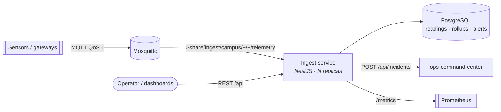
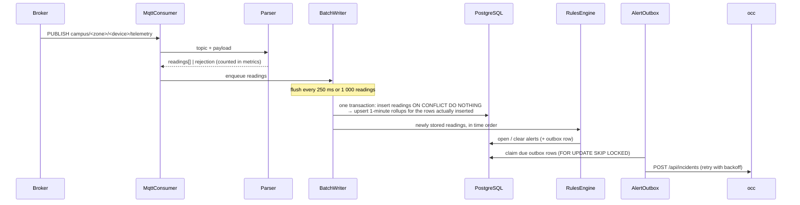

# Architecture

> Status: **M1 — Ingest to alert**. Updated with every milestone.

## 1. Problem

Buildings on a campus report readings from hundreds of sensors — temperatures in server rooms,
CO₂ in reading rooms, power draw per floor. Operations needs three things from that stream:

1. **Every reading kept**, queryable by device and time range, cheaply summarised per minute.
2. **Threshold breaches turned into alerts** quickly, without alert storms when a value hovers
   around a limit.
3. **Alerts delivered to the command center** ([ops-command-center](https://github.com/truongtankhanh/ops-command-center))
   as incidents, reliably, even when it is briefly down.

The reference site is the fictional **Langbiang Tech Campus**; devices and readings are synthetic.

### Quality goals

| Goal           | Target in M1                                                                                 |
| -------------- | -------------------------------------------------------------------------------------------- |
| Throughput     | Several thousand readings/s on one small instance (measured: [benchmarks.md](benchmarks.md)) |
| Ingest latency | A reading is queryable within ~0.5 s of arrival                                              |
| Completeness   | Duplicates never stored; data gaps are _measured_, not guessed                               |
| Alert quality  | No flapping: rules use a consecutive-breach count and a separate clear threshold             |
| Delivery       | Alerts reach the command center at least once, with retries and backoff                      |
| Operability    | Stateless pods, horizontal scale-out, Prometheus metrics, health and readiness probes        |

## 2. Context

## 3. Data flow inside the ingest service

## 4. Data model

| Table            | Key                           | Purpose                                                                                  |
| ---------------- | ----------------------------- | ---------------------------------------------------------------------------------------- |
| `device`         | `id` (e.g. `dc-temp-01`)      | Registry: kind, zone code, metrics it reports. Unknown devices are rejected and counted. |
| `reading`        | `(device_id, metric, ts)`     | Raw readings. **Range-partitioned by day** on `ts`; the key makes redelivery harmless.   |
| `rollup_1m`      | `(device_id, metric, bucket)` | Per-minute `count / sum / min / max`, maintained in the same transaction as the insert.  |
| `alert`          | `id`                          | `open` → `cleared` lifecycle, with the triggering and clearing values.                   |
| `alert_delivery` | `id`                          | Outbox: one row per alert event to deliver, with attempts and next retry time.           |

Partitions are created ahead (today + 2 days) and dropped after the retention window by a
maintenance job inside the service — no external cron.

## 5. Delivery guarantees, stated honestly

- **Device → broker:** QoS 1, at least once.
- **Broker → ingest:** the client acknowledges on receipt (see [ADR-0002](adr/0002-ack-on-receipt-with-bounded-loss.md)).
  If a pod is killed without warning, readings received in the last flush window (≤ 250 ms) can
  be lost. Graceful shutdown drains the buffer first, so rolling deploys lose nothing.
- **Gaps are measured.** Devices send a sequence number; the service tracks it per device and
  exports `telemetry_sequence_gaps_total`. Data completeness is a number on a dashboard, not an
  assumption.
- **Duplicates never stored** — redelivered readings hit the primary key and are counted as
  `duplicate`.
- **Alerts → command center:** transactional outbox, at least once, exponential backoff.

## 6. Scaling out

Replicas join the same MQTT **shared subscription** group, so the broker spreads messages across
them ([ADR-0001](adr/0001-mqtt-shared-subscriptions.md)). Database writes are idempotent and
outbox claiming uses `SKIP LOCKED`, so replicas never double-deliver an alert row. Rule state is
per device: the shared subscription is keyed per message, not per device, so the rules engine
rebuilds a device's state from the database when it sees a device it has no state for
([ADR-0004](adr/0004-rules-with-hysteresis.md)).

## 7. Decisions

| ADR                                                       | Decision                                                                                |
| --------------------------------------------------------- | --------------------------------------------------------------------------------------- |
| [0001](adr/0001-mqtt-shared-subscriptions.md)             | Scale ingest horizontally with MQTT 5 shared subscriptions                              |
| [0002](adr/0002-ack-on-receipt-with-bounded-loss.md)      | Acknowledge on receipt; bound and measure the loss window instead of acking per write   |
| [0003](adr/0003-plain-postgres-partitions-and-rollups.md) | Plain PostgreSQL: daily partitions + write-time rollups, TimescaleDB as an upgrade path |
| [0004](adr/0004-rules-with-hysteresis.md)                 | Threshold rules with consecutive-breach count and a separate clear threshold            |
| [0005](adr/0005-alert-outbox.md)                          | Deliver alerts through a transactional outbox                                           |
